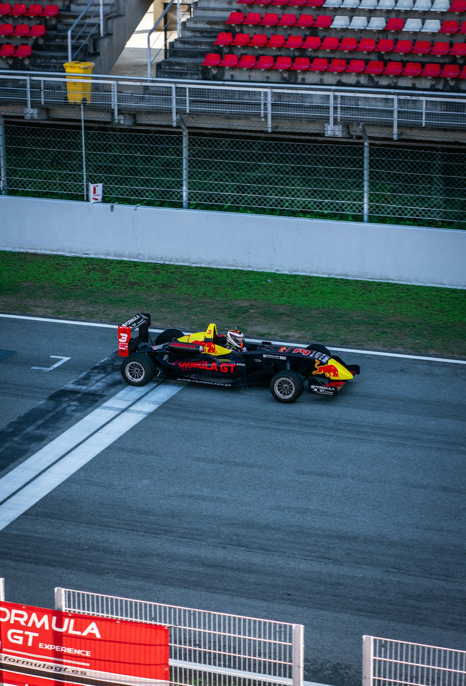

<!--
  ===================================================================
  dbisina/dbisina  —  GitHub Profile README  (F1 broadcast theme)
  -------------------------------------------------------------------
  To use: create a public repo named exactly "dbisina", drop this
  README.md and the /assets folder at its root, then commit.
  GitHub renders /assets images via its camo proxy automatically.

  TODO before you ship — search for "TODO:" below:
    • LinkedIn / X handles (placeholders use "dbisina")
    • Public email address
    • Any telemetry flavor numbers you want to tweak (LAP / SPD)
  Live stat cards already read your real dbisina data automatically.
  ===================================================================
-->

<!-- ============================ HERO ============================ -->

<!-- ===================== BROADCAST HUD BAR ===================== -->

<!-- ============================ NAME ============================ -->
<h1 align="center">DBISINA</h1>

  

 

<!-- ====================== S1 — ABOUT ====================== -->

&nbsp;**ABOUT** · DRIVER PROFILE

<table>
<tr>
<td width="34%" valign="top">

</td>
<td width="66%" valign="top">

I'm an **AI &amp; Systems Engineer** working at the seam between hardware and software.
My focus is **AI kernel optimization**, scalable architecture, and **high-performance computing**.

I don't just write code — I engineer solutions that are **robust, secure, and blazingly fast.**
Every commit is a lap; the goal is the apex.

> *"Building foundational technology that moves humanity forward."*

</td>
</tr>
</table>

<!-- ====================== S2 — SECTORS ====================== -->

&nbsp;**SECTORS** · WHERE I RACE

<table>
<tr>
<td width="33%" valign="top">

**FOCUS**
 AI systems &amp; kernels
 Low-level optimization

</td>
<td width="33%" valign="top">

**EXPLORING**
 Quantum computing &amp; FPGA
 Neuromorphic engineering

</td>
<td width="33%" valign="top">

**COLLABORATE**
 Open source &amp; infra
 Hackathons &amp; events

</td>
</tr>
</table>

<!-- ====================== S3 — ARSENAL ====================== -->

&nbsp;**ARSENAL** · TECH STACK

LANGUAGES 

  

AI &amp; SYSTEMS 

  

INFRA &amp; WEB 

<!-- ====================== S4 — TELEMETRY ====================== -->

&nbsp;**TELEMETRY** · LIVE GITHUB DATA

 

  

<!-- ====================== S5 — PIT WALL ====================== -->

&nbsp;**PIT WALL** · OBJECTIVES THIS SEASON

<table>
<tr><td width="44"><b>01</b></td><td>AI kernel generation &amp; optimization (U-HOP vision)</td></tr>
<tr><td><b>02</b></td><td>Scalable backend &amp; infrastructure systems</td></tr>
<tr><td><b>03</b></td><td>Full-stack platforms with real-world impact</td></tr>
<tr><td><b>04</b></td><td>Bridging hardware and software intelligence</td></tr>
<tr><td><b>05</b></td><td>Performance optimization &amp; security hardening</td></tr>
</table>

> *"The best way to predict the future is to invent it."* &nbsp;—&nbsp; **ALAN KAY**

<!-- ====================== S7 — RADIO ====================== -->

&nbsp;**RADIO** · CONNECT

<!-- TODO: replace LinkedIn / X handles and the email with your real ones -->

BUILDING THE FUTURE, <b>ONE COMMIT AT A TIME</b> · FROM THE REDLINE GARAGE

