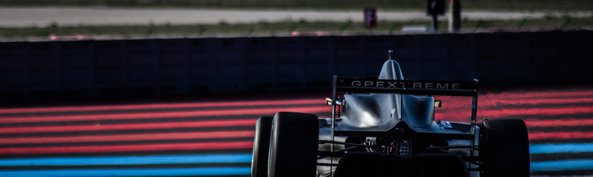
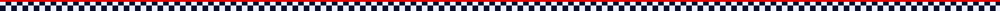
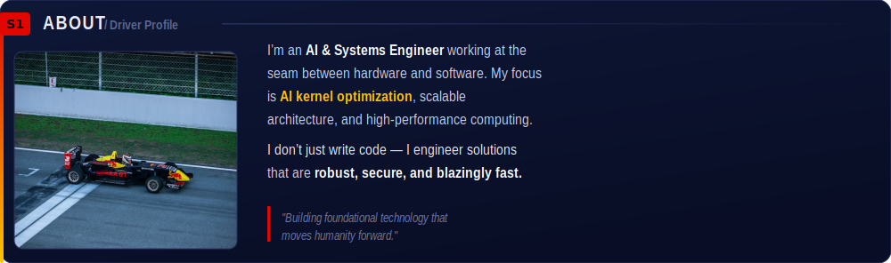
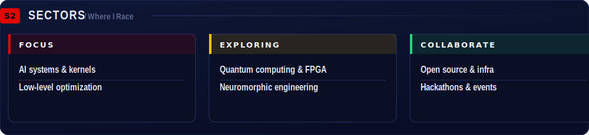
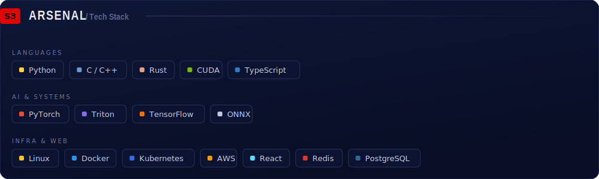
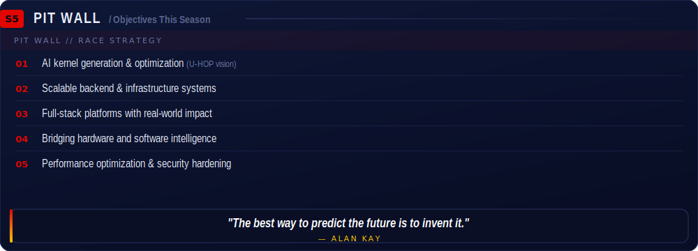

<!--
  ===================================================================
  dbisina/dbisina  —  GitHub Profile README  (F1 broadcast theme)
  ===================================================================
  HOW THIS WORKS (the "CSS on a README" trick):
  GitHub strips <script> and inline style= from README HTML, so a
  normal styled page collapses to bare text. BUT GitHub renders
  -embedded SVG, and an SVG carries its OWN <style>, gradients,
  fonts and CSS/SMIL animation — rendered client-side by the browser.
  So every "card" below is an SVG in /assets that survives the
  sanitizer as an image. Animations (car, HUD, blinking cursor) run.
  Links + live stat cards stay as <a>/badges (an -SVG can't hold
  clickable regions).

  TO SHIP:
    1. Make a public repo named exactly  dbisina
    2. Commit this README.md + the /assets folder at its root
    3. (optional) to tweak the panels: edit build_svgs.py, run
       `python build_svgs.py`, recommit /assets

  TODO — search "TODO:" below:
    • LinkedIn / X handles (placeholders use "dbisina")
    • Email + Buy Me a Coffee username
  Live stat cards already read your real dbisina data automatically.
  ===================================================================
-->

<!-- TODO: replace LinkedIn / X handles, the email, and the coffee username with your real ones -->

  

<b>BUILDING THE FUTURE, ONE COMMIT AT A TIME</b> &nbsp;·&nbsp; FROM THE REDLINE GARAGE

